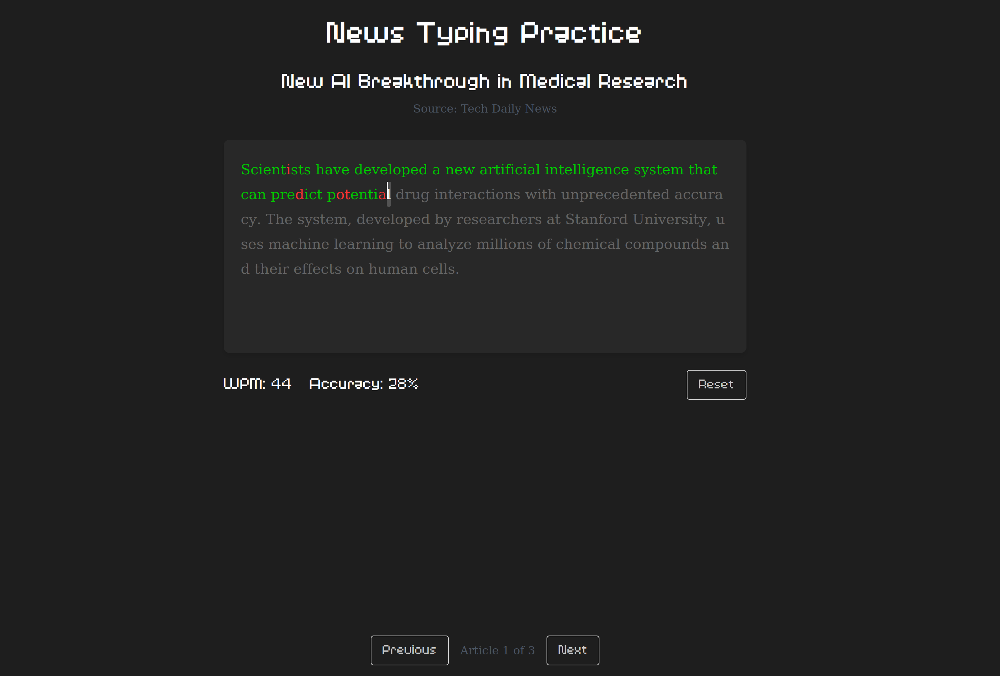

# NewsTyper

A modern web application that combines touch typing practice with news reading. Practice your typing skills while staying informed with the latest news articles.

## Features

- Interactive typing practice interface
- Real-time news article display
- Single-paragraph articles optimized for typing practice
- Modern, responsive UI built with Tailwind CSS
- TypeScript support for better development experience

## Tech Stack

- **Frontend:**
  - Next.js 15.2
  - React 19
  - Tailwind CSS
  - TypeScript

- **Development Tools:**
  - ESLint
  - PostCSS
  - TypeScript

## Getting Started

### Prerequisites

- Node.js (Latest LTS version recommended)
- npm or yarn

### Installation

1. Clone the repository:
   ```bash
   git clone https://github.com/daanblom/newstyper
   cd newstyper
   ```

2. Install dependencies:
   ```bash
   npm install
   # or
   yarn install
   ```

3. Start the development server:
   ```bash
   npm run dev
   # or
   yarn dev
   ```

4. Open [http://localhost:3000](http://localhost:3000) in your browser to see the application.

## Project Structure

- `/src` - Source code
- `/public` - Static assets
- `/docs` - Project documentation
- `/docs/idea.txt` - Project concept and requirements

## Development

The project is structured into three main components:

1. **Frontend**
   - Web interface for typing practice
   - Article display
   - User interaction

2. **Backend**
   - Article database
   - Manual article management (initial phase)

3. **Server-side** (Planned)
   - News article fetching
   - AI-powered article transformation
   - Database management

## Scripts

- `npm run dev` - Start development server
- `npm run build` - Build for production
- `npm run start` - Start production server
- `npm run lint` - Run ESLint

## Contributing

Contributions are welcome! Please feel free to submit a Pull Request.

## License

This project is licensed under the MIT License - see the LICENSE file for details.
